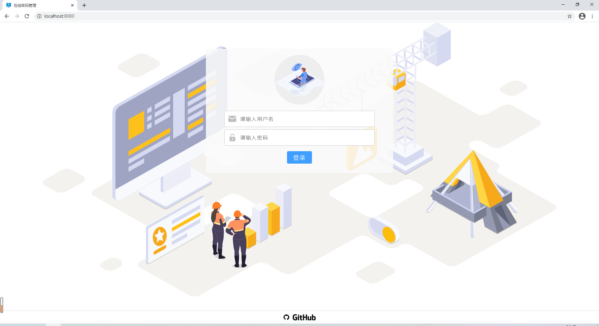
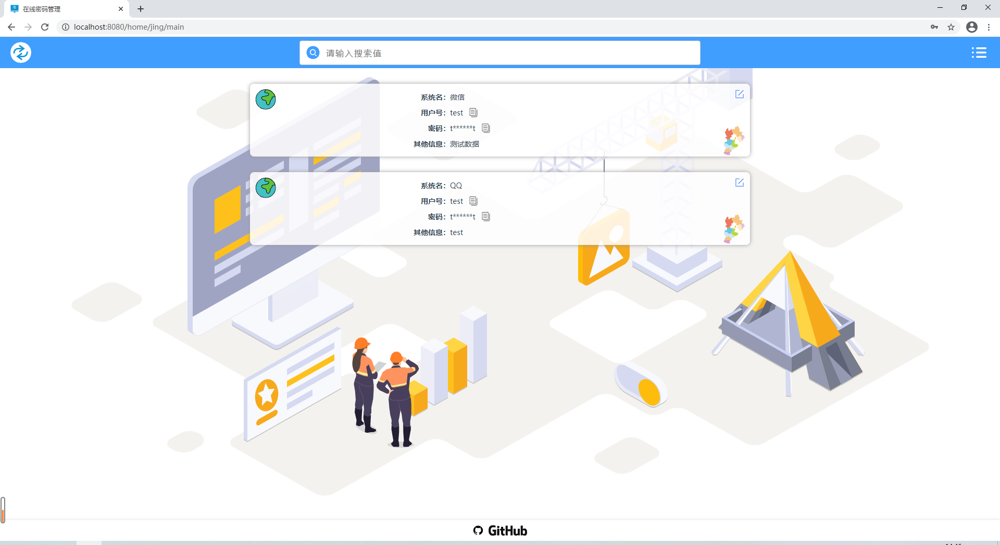

# 前端项目使用

> 初始化项目

```php
git clone https://github.com/enqiangjing/suisei.git

# 进入 fe-password-online 目录
cd fe-password-online
# 安装依赖
npm install
# 开发环境
npm run dev
# 打包
npm run build
```

> 项目页面
>
> 1. 登录  
>      
>    
> 2. 加载密钥  
>    
> 3. 密钥加载完成  
>    
> 4. 增加账号  
>    
> 5. 编辑账号  
>    
> 6. 效果  
>    
